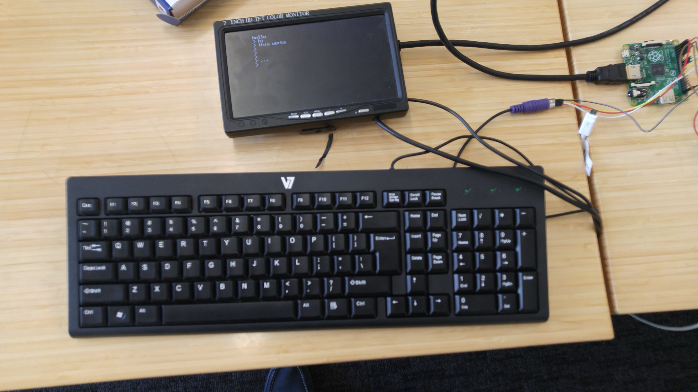

I wanted to learn Rust, and I know how to work the Pi from C and have
a bunch of code that does that, so I thought it would be fun to try
and build an interactive computer out of the Raspberry Pi using Rust
instead of C.

**No guarantees that this is idiomatic Rust -- it's mostly
hand-transliterated C.** I think that the PS/2 driver and the generic
ring buffer are fairly nice, though.

## What it does

This is a bare-metal program that runs on the Raspberry Pi. It's like
an operating system. (If an operating system has two jobs --
hardware abstraction and multiplexing resources -- we might say that
this thing does one of the two.)

You copy it to a SD card, put it in the Pi, and turn the Pi on (_note:
I think you actually need to use a bootloader right now_), and plug it
into an HDMI monitor and a PS/2 keyboard.

It gives you a console. It talks to the Pi's video card, to the UART
peripheral on the board, and to a PS/2 keyboard. You can type and see
things on the screen (I bundled a [font](src/gl/font.rs)).

The console has one actual command so far: `reset` (which I
implemented so that I could recompile and update it fast!)

All the code running on the Pi (except some standard library functions
that format strings and stuff) should just be Rust code in this
project.

(I'd like to strip dead code too, to get rid of unused library code in
the binary. Ideally, everything running on the thing would be
obvious.)

## How I built it

I mostly worked off of reference C code I had lying around. I wrote
drivers in Rust for the GPU framebuffer, for the serial peripheral,
and for the GPIO pins.

I made a basic console and found a bitmap font online to display
letters.

I wrote a PS/2 client that uses the serial line to read scancodes from
a PS/2 keyboard, so you can type.

(I set up interrupts and install an interrupt handler so that the PS/2
driver is nonblocking.)

## Weird stuff

The hardest part was getting it to build; that took like most of a
day, when I went beyond
[blink](http://blog.thiago.me/raspberry-pi-bare-metal-programming-with-rust/)
and started actually trying to use the Rust standard library and it
started complaining.

The key insight there was using `gc-sections` in the linker command
and then stubbing out the remaining undefined symbols by hand.

Some things in C but not Rust that I had to hack around:

- I had a ton of trouble aligning global variables in memory. I did
  [something with SIMD and padding](src/gl/mod.rs) that seems to work
  reliably, but Rust doesn't have a real align attribute for variable
  declarations.

- Hard to get data from the linker into the program. I couldn't
  `extern` variables in Rust, so had to push things like the interrupt
  table start position as arguments to an
  [`extern` initializer function](src/main.rs).

- No `volatile` attribute, but `volatile_load` and `volatile_store`
  are OK (though Rust claims they're an unstable interface).

The code is probably really un-idiomatic Rust. Tons of unsafe
blocks -- but at least I know what to clean up later.

The I/O stuff, talking to hardware, looks messier than in C, but the
programming on top of the I/O layer is hopefully nicer in Rust.

## Cool stuff

Having the Rust core library available is pretty useful.

The PS/2 driver I wrote is a ton nicer in Rust than it is in C,
because it's basically a state machine, and Rust has way more
expressive types.

It's cool that Rust does bounds and null checking and can panic, and I
set up a way for them to get reported over serial and onscreen,
too. Surprisingly civilized.

## Further steps

I was working on connecting to an ESP8266 but the power draw is too
much to power it directly off the Pi, I think. That would let you do
web browsing and wireless connection to a real computer, without
needing to also write a USB driver, Wi-Fi dongle driver, and network
stack. You could update it over the air, maybe.

Add a dynamic memory allocator.

Onboard programming language -- some kind of Lisp variant? This would
better test whether Rust is better for general programming than C.

GUI? PS/2 mouse support would be a natural next step.

Improve style, use the concurrency stuff in Rust and make things
safer. Figure out where unsafe really belongs. Get better types on
things.

Some kind of persistent storage, like on the SD card? The main thing
MS-DOS has that I don't right now.
